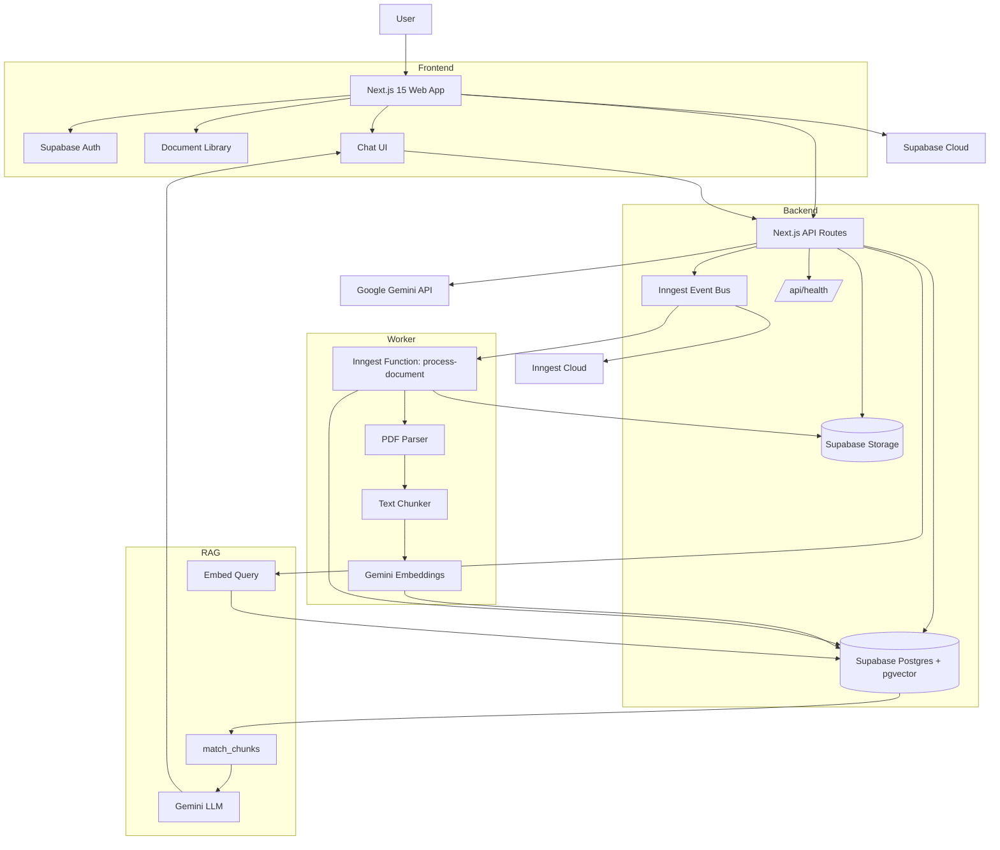
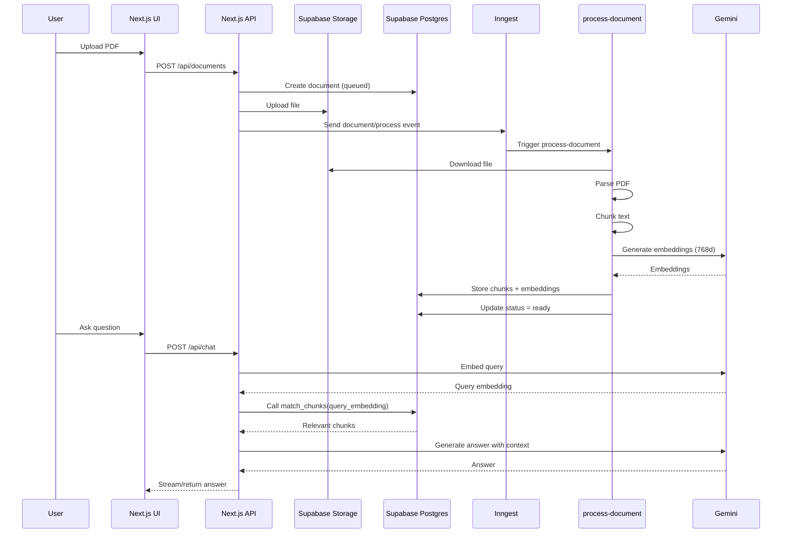
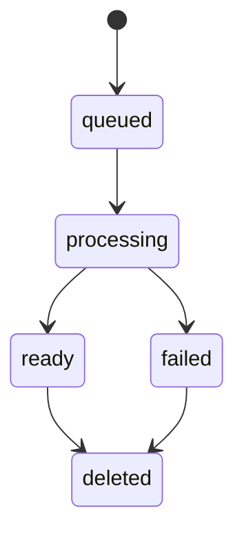

# 📚 DocMind

**DocMind** is a full-stack, AI-powered document intelligence application that lets you upload PDFs, process them in the background, and chat with your documents using Retrieval-Augmented Generation (RAG).

Built with **Next.js 15**, **Supabase**, **Inngest**, **Google Gemini**, and **Docker**.


---

## ✨ Features

- 🔐 **Authentication** with Supabase Auth
- 📄 **PDF upload** and document library
- ⚙️ **Background processing** with Inngest
- 🧩 **Automatic chunking** and text extraction
- 🧠 **Gemini embeddings** stored in Supabase Postgres with `pgvector`
- 🔎 **Vector similarity search** via `match_chunks`
- 💬 **RAG chat** with document context
- 📊 **Document status tracking**: `queued`, `processing`, `ready`, `failed`, `deleted`
- 🐳 **Docker-ready** for Hugging Face Spaces
- ❤️ **Health check endpoint** at `/api/health`
- 🧪 **Testing** with Vitest and Playwright

---

## 🏗️ Architecture



---

## 🔄 RAG Pipeline Flow



---

## 📌 Document Status State



---

## 🧰 Tech Stack

| Layer | Technology |
|---|---|
| Framework | Next.js 15 (App Router) |
| Language | TypeScript |
| UI | React, Tailwind CSS, Radix UI, Lucide |
| Auth & DB | Supabase Auth, Supabase Postgres |
| Vector Search | `pgvector`, `match_chunks` |
| Storage | Supabase Storage |
| Background Jobs | Inngest |
| AI / Embeddings | Google Gemini |
| Testing | Vitest, Playwright, Testing Library |
| Deployment | GitHub, Hugging Face Spaces, Docker |

---

## 📁 Project Structure

```text
DocMind/
├── src/
│   ├── app/
│   │   ├── (auth)/
│   │   │   ├── login/
│   │   │   ├── signup/
│   │   │   ├── reset-password/
│   │   │   └── verify-email/
│   │   ├── (dashboard)/
│   │   │   ├── chat/
│   │   │   ├── dashboard/
│   │   │   ├── library/
│   │   │   └── settings/
│   │   ├── (marketing)/
│   │   ├── api/
│   │   │   ├── auth/callback/
│   │   │   ├── chat/
│   │   │   ├── conversations/
│   │   │   ├── documents/
│   │   │   ├── health/
│   │   │   └── inngest/
│   │   ├── globals.css
│   │   ├── layout.tsx
│   │   └── providers.tsx
│   ├── components/
│   │   ├── documents/
│   │   └── ui/
│   ├── hooks/
│   ├── inngest/
│   │   ├── client.ts
│   │   └── functions/process-document.ts
│   ├── lib/
│   │   ├── auth/
│   │   ├── documents/
│   │   ├── embeddings/
│   │   ├── errors/
│   │   ├── observability/
│   │   ├── rag/
│   │   ├── rate-limit/
│   │   ├── storage/
│   │   ├── supabase/
│   │   ├── env.ts
│   │   └── utils.ts
│   ├── server/actions/
│   ├── types/
│   └── middleware.ts
├── supabase/migrations/
├── tests/
│   ├── setup.ts
│   └── unit/
├── .dockerignore
├── .env.example
├── .gitignore
├── Dockerfile
├── next.config.ts
├── package.json
├── playwright.config.ts
├── postcss.config.mjs
├── tailwind.config.ts
├── tsconfig.json
└── vitest.config.ts
```

> `.env.local` is intentionally **excluded** — it should never be committed.

---

## 🚀 Getting Started

### Prerequisites

- Node.js **20+**
- npm or pnpm
- Supabase project
- Google Gemini API key
- Inngest account (or local Inngest Dev Server)

### 1. Clone and install

```bash
git clone https://github.com/subhra015/DocMind.git
cd DocMind
npm install
```

### 2. Configure environment variables

Copy `.env.example` to `.env.local`:

```bash
cp .env.example .env.local
```

On Windows PowerShell:

```powershell
copy .env.example .env.local
```

Fill in the values:

| Variable | Required | Scope | Description |
|---|---:|---|---|
| `NEXT_PUBLIC_SUPABASE_URL` | ✅ | Public | Supabase project URL |
| `NEXT_PUBLIC_SUPABASE_ANON_KEY` | ✅ | Public | Supabase anonymous key |
| `SUPABASE_SERVICE_ROLE_KEY` | ✅ | Server only | Supabase service role key. Never expose to client |
| `GEMINI_API_KEY` | ✅ | Server only | Google Gemini API key |
| `INNGEST_EVENT_KEY` | ✅ | Server | Inngest event key |
| `INNGEST_SIGNING_KEY` | ✅ | Server | Inngest signing key for production |
| `INNGEST_APP_ID` | ✅ | Server | Inngest app ID, e.g. `docmind` |
| `NEXT_PUBLIC_APP_URL` | ✅ | Public | App URL, e.g. `http://localhost:3000` |
| `PORT` | ✅ | Runtime | `3000` locally, `7860` on Hugging Face |

### 3. Run locally

```bash
npm run dev
```

Start Inngest Dev Server in a second terminal:

```bash
npx inngest-cli dev -u http://localhost:3000/api/inngest
```

Open [http://localhost:3000](http://localhost:3000).

---

## 🗄️ Supabase Setup

Enable `pgvector` in a dedicated `extensions` schema:

```sql
create schema if not exists extensions;
create extension if not exists vector with schema extensions;
```

Ensure the embedding column uses **768 dimensions** for Gemini:

```sql
alter table public.chunks
alter column embedding type extensions.vector(768);
```

Allow document statuses:

```sql
alter table public.documents
drop constraint if exists documents_status_check;

alter table public.documents
add constraint documents_status_check
check (status in ('queued', 'processing', 'ready', 'failed', 'deleted'));
```

Add required document columns if missing:

```sql
alter table public.documents add column if not exists checksum text;
alter table public.documents add column if not exists original_filename text;
alter table public.documents add column if not exists mime_type text;
alter table public.documents add column if not exists processing_progress integer default 0;
```

Recreate `match_chunks` after changing the vector dimension. Example signature:

```sql
-- Use your actual function signature from Supabase.
-- Example:
-- public.match_chunks(query_embedding extensions.vector(768), match_count integer)
```

> Always verify the real signature with `pg_get_function_identity_arguments`.

---

## 🔌 API Endpoints

| Method | Endpoint | Description |
|---|---|---|
| `GET` | `/api/health` | Health check |
| `GET` | `/api/documents` | List documents |
| `POST` | `/api/documents` | Create document / get upload URL |
| `GET` | `/api/documents/:id` | Get document details |
| `GET` | `/api/documents/:id/signed-url` | Get a signed URL for the file |
| `POST` | `/api/documents/:id/upload-complete` | Mark upload complete and trigger processing |
| `POST` | `/api/documents/:id/retry` | Retry a failed processing job |
| `GET` | `/api/conversations` | List conversations |
| `POST` | `/api/conversations` | Create conversation |
| `GET` | `/api/conversations/:id` | Get conversation with messages |
| `POST` | `/api/chat` | Send a message and get a RAG answer |
| `GET` | `/api/auth/callback` | Supabase auth callback |
| `POST` | `/api/inngest` | Inngest handler route |

---

## 🧪 Testing

```bash
npm run lint
npm run typecheck
npm run test
npm run test:e2e
```

---

## 🐳 Docker

Build locally:

```bash
docker build -t docmind .
docker run -p 7860:7860 --env-file .env.local docmind
```

The container exposes port **7860**, which is the expected port for Hugging Face Docker Spaces.

> **Tip:** Add a `.dockerignore` file to keep the image small. Exclude `node_modules`, `.next`, `.git`, `.env.local`, `tests`, `playwright-report`, and `files.txt`.

---

## ☁️ Deployment

### GitHub

```bash
git init
git add .gitignore README.md
git add .
git commit -m "docs: add professional README and project setup"
git branch -M main
git remote add origin https://github.com/subhra015/DocMind.git
git push -u origin main
```

If the remote already exists:

```bash
git add .gitignore README.md
git add .
git commit -m "docs: add professional README and project setup"
git push origin main
```

### Hugging Face Spaces

1. Create a new **Docker Space** (e.g. `subhra015/DocMind`).
2. Add repository secrets in **Settings → Repository secrets**:
   - `SUPABASE_SERVICE_ROLE_KEY`
   - `GEMINI_API_KEY`
   - `INNGEST_EVENT_KEY`
   - `INNGEST_SIGNING_KEY`
   - `INNGEST_APP_ID`
   - `NEXT_PUBLIC_SUPABASE_URL`
   - `NEXT_PUBLIC_SUPABASE_ANON_KEY`
   - `NEXT_PUBLIC_APP_URL`
   - `PORT=7860`
3. Ensure the `README.md` starts with the Hugging Face front matter (already present at the top of this file).
4. Add the HF remote and push:

```bash
git remote add hf https://huggingface.co/spaces/subhra015/DocMind
git push hf main
```

If the remote already exists:

```bash
git push hf main
```

---

## 🔐 Security Notes

- **Never commit `.env.local`**.
- Rotate any keys that were ever pasted into chat, logs, or commits.
- Keep `SUPABASE_SERVICE_ROLE_KEY` and `GEMINI_API_KEY` server-side only.
- Enable Supabase Row Level Security (RLS) for user-owned tables.
- Use `INNGEST_SIGNING_KEY` in production.
- Use `isDev: true` only for local Inngest development.

If `.env.local` is already tracked:

```bash
git rm --cached .env.local
git commit -m "chore: stop tracking .env.local"
```

If `node_modules` or `.next` are tracked:

```bash
git rm -r --cached node_modules .next
git commit -m "chore: stop tracking build artifacts"
```

---

## 🛠️ Troubleshooting

| Problem | Cause | Fix |
|---|---|---|
| `cookies().getAll() should be awaited` | Next.js 15 async cookies | `await cookies()` and make helper async |
| `PGRST204: Could not find 'checksum' column` | Missing DB column | Add `checksum` and other missing columns |
| `23514: violates documents_status_check` | Old status constraint | Drop and recreate constraint with new statuses |
| Inngest routes blocked | Middleware matcher too broad | Exclude `api/inngest` in `middleware.ts` |
| `No x-inngest-signature provided` | Local dev signature check | Set `isDev: true` locally |
| `Cannot read properties of undefined (reading 'map')` | Inngest steps run isolated | Return data from each `step.run()` |
| `buffer.slice is not a function` | Buffer serialized between steps | Download file inside the parse step |
| `expected 1536 dimensions, not 768` | Embedding dimension mismatch | Alter column to `extensions.vector(768)` |
| Library still says “Queued” | Supabase Realtime disabled | Refresh or enable Realtime replication |
| Chat send button greyed out | No active conversation | Create a new conversation with `+` |

---

## 🗺️ Roadmap

- [ ] Support DOCX, TXT, and Markdown uploads
- [ ] Streaming chat responses
- [ ] Citation highlights in answers
- [ ] Team workspaces and sharing
- [ ] Usage analytics and quotas
- [ ] Multi-model support
- [ ] Reranking and hybrid search

---

## 🤝 Contributing

1. Fork the repository.
2. Create a feature branch:
   ```bash
   git checkout -b feature/amazing-feature
   ```
3. Commit your changes:
   ```bash
   git commit -m "feat: add amazing feature"
   ```
4. Push the branch:
   ```bash
   git push origin feature/amazing-feature
   ```
5. Open a Pull Request.

---

## 📄 License

This project is licensed under the **MIT License**.

> To make this official, create a `LICENSE` file at the root with the MIT License text and update the year and author.

---

## 🙏 Acknowledgements

- [Next.js](https://nextjs.org/)
- [Supabase](https://supabase.com/)
- [Inngest](https://www.inngest.com/)
- [Google Gemini](https://ai.google.dev/)
- [Tailwind CSS](https://tailwindcss.com/)
- [Radix UI](https://www.radix-ui.com/)
- [Lucide](https://lucide.dev/)